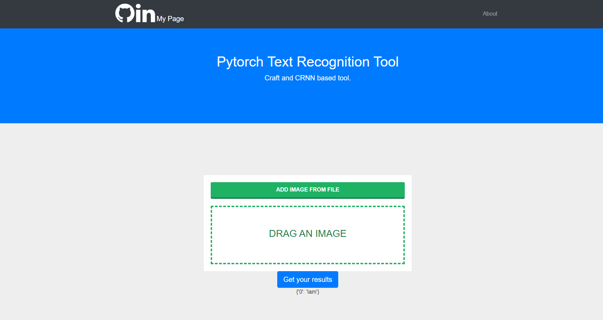

# Text recognition tool

Text recognition with Pytorch Using CRNN and CRAFT 
pretrained models. 

Install it, install requirements.txt by 

```python
python -m pip install requirements.txt
```
and check argparsers. at the moment it is only input image so 

```python

> source venv/Scripts/activate
> python app.py --input_file test_image.jpeg

```





``` 

python -m venv venv

```

Activate it by 


```
source venv/Scripts/activate
```

Install requirements using ``` pip```


``` 
python -m pip install -r requirements.txt
```

and run ``` app.py ``` 

```

python app.py 

```

then go to 


```localhost:8000``` 

and test it. 


### 
I decided to put it on simplest flask module only 
to show it's basic functionality. 


### To dos


add frontend and some fancy vis. 

